<p align="center">
  <a href="https://github.com/somalip/pyre">
    
  </a>
</p>

<h1 align="center">pyre</h1>

<p align="center">
  <b>Cross-platform system telemetry and diagnostics suite for macOS, Linux, and Windows.</b><br />
  Hardware-level performance metrics, interactive TUI, web dashboards, encrypted P2P mesh, and native macOS window.
</p>

<p align="center">
  <a href="https://www.npmjs.com/package/pyre-cli"></a>
  <a href="package.json"></a>
  <a href="#requirements"></a>
  <a href="#requirements"></a>
  <a href="LICENSE"></a>
</p>

<p align="center">
  <a href="#quick-install">Quick Install</a> •
  <a href="#quick-start">Quick Start</a> •
  <a href="#interactive-tui">Interactive TUI</a> •
  <a href="#highlights">Highlights</a> •
  <a href="#native-ui-and-web-dashboard">Native UI &amp; Web</a> •
  <a href="#comparison">Comparison</a> •
  <a href="#keybindings">Keybindings</a> •
  <a href="#cli-reference">CLI Reference</a>
</p>

<br />

<p align="center">
  
</p>

---

## Quick Install

```bash
# macOS / Linux (curl)
curl -fsSL https://raw.githubusercontent.com/somalip/pyre/main/install.sh | bash

# Homebrew (macOS)
brew install somalip/pyre/pyre

# Windows (PowerShell)
irm https://raw.githubusercontent.com/somalip/pyre/main/install.ps1 | iex

# npm (Global)
npm install -g pyre-cli
```

---

## Quick Start

```bash
# Interactive live TUI dashboard with real-time graphs and telemetry
pyre live

# One-shot instant health summary in plain English
pyre check

# Launch the native macOS Activity Monitor window
pyre ui

# Serve a real-time web portal with Server-Sent Events (SSE)
pyre web

# Run statistical z-score anomaly detection over historical telemetry
pyre anomalies --since 7d

# Benchmark a command execution and compute real kWh energy cost
pyre bench "npm run build"

# Audit system permissions, sensors, SIP, and diagnostic health
pyre doctor
```

---

## Interactive TUI

Launch with `pyre live` for a responsive, full-terminal dashboard featuring:

- **Live Sparklines and Histograms**: Real-time 60-second rolling charts for CPU, memory, thermals, and network throughput.
- **Apple Silicon Cluster Telemetry**: Granular Performance (P-Core) and Efficiency (E-Core) usage, GPU cores, and Apple Neural Engine (ANE) load.
- **Process Management**: Search-as-you-type fuzzy filtering (`/`), instant tree view hierarchy (`t`), and custom signal dispatch (`k`, `S`).
- **Visual Customizer (`c`)**: Switch on the fly between 6 built-in themes (`default`, `dracula`, `cyberpunk`, `monochrome`, `nord`, `gruvbox`) or create custom color maps.
- **Continuous Logging (`l`)**: Seamlessly log rolling telemetry directly to CSV files for replay and historical analysis.

---

## Highlights

| Capability | Description |
|---|---|
| **Deep Hardware Probes** | Granular Apple Silicon P/E cluster utilization, SMC thermals, per-core CPU breakdown, GPU VRAM, battery cycle health, and real-time power draw in watts. |
| **Interactive TUI & Themes** | Rolling sparklines, process trees, full mouse navigation, and 6 built-in color schemes with custom panel configuration. |
| **Native macOS App Mode** | High-performance native macOS liquid-glass dashboard window (`pyre ui`) with draggable frames, widget mode (`--compact`), and floating window support (`--ontop`). |
| **Live Web Portal** | Zero-latency browser dashboard (`pyre web`) powered by Server-Sent Events (SSE), Chart.js visualizers, and responsive dark theme. |
| **Encrypted P2P Streaming** | Directly stream live telemetry across nodes over TCP with TLS encryption, SHA-256 handshake challenge-response, and HMAC-SHA256 message signing. |
| **Fleet & SSH Aggregation** | Monitor remote nodes over SSH (`pyre ssh <host>`) or aggregate hundreds of servers into an auto-tiled overview (`pyre fleet`). |
| **Socket & Packet Forensics** | Track socket connection states (`ESTABLISHED`, `LISTENING`, `TIME_WAIT`), top remote hosts, and per-process network bandwidth. |
| **AI Anomaly Explanation** | Explain performance spikes and thermal throttles in plain English using local Ollama models or OpenAI (`pyre explain`). |
| **Multi-Format Export** | Export instant snapshots to JSON, CSV, TSV, HTML, or Markdown reports, plus an importable Grafana dashboard template. |

---

## Native UI and Web Dashboard

### Native macOS Window (`pyre ui`)

Run Pyre as a standalone macOS desktop application without third-party heavyweight runtimes:

```bash
# Standard floating window
pyre ui

# Compact desktop widget mode pinned always on top
pyre ui --compact --ontop

# Expose web endpoint to local network alongside native window
pyre ui --lan --port 8080
```

### Browser Web Dashboard (`pyre web`)

Serve a browser dashboard accessible anywhere on your network:

```bash
# Start local web dashboard
pyre web --port 3000

# Broadcast over local area network with access PIN
pyre web --lan --port 3000
```

---

## Comparison

| Feature | Pyre | btop | htop | Glances |
|---|:---:|:---:|:---:|:---:|
| **Interactive TUI & Sparklines** | Yes (6 themes + JSON) | Yes | Limited | Yes |
| **Native macOS Desktop Window** | Yes (Swift Cocoa) | No | No | No |
| **Apple Silicon P/E + GPU + ANE** | Yes (Granular watts) | Partial | Partial | Partial |
| **Encrypted P2P Telemetry** | Yes (TLS + HMAC) | No | No | Partial (Plain) |
| **Real-time Web Dashboard (SSE)** | Yes (Zero-config) | No | No | Yes |
| **Multi-Host Fleet Aggregation** | Yes (SSH / P2P) | No | No | Yes (Web only) |
| **Socket Connection Forensics** | Yes | Partial | No | Partial |
| **Statistical Anomaly Radar** | Yes (Z-score) | No | No | No |
| **Energy & Cost Profiler** | Yes (kWh / Joules) | No | No | No |
| **System Security Doctor** | Yes (SIP / Sensors) | No | No | No |
| **Export Formats** | JSON, CSV, TSV, HTML, MD | No | No | InfluxDB, CSV |

---

## Keybindings

Inside `pyre live`:

### Navigation & Views

| Key | Action | Key | Action |
|:---:|---|:---:|---|
| `q` | Quit dashboard | `1`–`9` | Jump directly to panel tab |
| `p` | Pause / resume live refresh | `←` / `→` | Switch active panel tab |
| `g` | Toggle history graphs on / off | `+` / `-` | Increase / decrease refresh interval |
| `b` | Cycle graph style (sparkline ↔ bar) | `d` | Toggle sensor detail expansion |
| `c` | Open theme & panel customizer | `?` | Toggle keyboard shortcuts overlay |

### Processes & Actions

| Key | Action | Key | Action |
|:---:|---|:---:|---|
| `/` | Search & filter processes | `k` | Enter process kill mode (type PID) |
| `t` | Toggle hierarchical tree view | `S` | Select termination signal (`SIGTERM`, `SIGKILL`) |
| `s` | Cycle sort (`cpu`, `mem`, `pid`, `user`) | `l` | Toggle continuous CSV background logging |
| `e` | Export snapshot (`json`, `csv`, `html`, `md`) | `r` | Start / stop P2P streaming server |

Mouse support: click any tab, button, or process row directly in the terminal, or scroll to browse processes.

---

## CLI Reference

### Dashboards & Views

```bash
pyre                            # Terminal snapshot
pyre live                       # Interactive full-screen TUI
pyre ui [--compact] [--ontop]   # Native macOS desktop window
pyre web [--port 3000] [--lan]  # Browser portal with live SSE stream
pyre fleet host1 host2 host3    # Unified multi-host fleet dashboard
pyre ssh user@server            # Stream stats from remote machine over SSH
```

### Telemetry, Diagnostics & Benchmarks

```bash
pyre check                      # One-line health summary
pyre anomalies [--since 7d]     # Statistical z-score anomaly detector
pyre doctor                     # Diagnostic audit of permissions, SIP, sensors
pyre bench "<cmd>"              # Profile execution time, memory, and kWh energy
pyre benchmark                  # 1-minute CPU benchmark scoring digits of PI
pyre netusage [--top 15]        # Real-time per-process socket & bandwidth forensics
pyre brew                       # Package manager health check & disk cache report
pyre smart                      # S.M.A.R.T. disk health monitor & drive wear
pyre blender                    # Background Blender 3D render job tracker
pyre pipe                       # Continuous newline-delimited JSON stream
```

### Automation, Profiles & Daemon

```bash
pyre watchdog                   # Autonomous daemon monitoring rules & killing rogue procs
pyre serve [--port 8080]        # Lightweight REST API server exposing JSON endpoints
pyre profile save <name>        # Save active configuration profile
pyre profile load <name>        # Restore saved profile
pyre config show                # Display current settings (~/.config/pyre/config.json)
pyre completions <zsh|bash>     # Generate shell auto-completions
```

---

## Encrypted P2P Streaming

Stream live system stats directly between hosts over TCP with mutual authentication:

```bash
# 1. On server machine (Host)
pyre p2p server --p2p-password "secret-token" --p2p-port 9876

# 2. On client machine (Viewer)
pyre p2p connect --p2p-host 192.168.1.50 --p2p-password "secret-token" --p2p-port 9876
```

Security and networking capabilities:
- **TLS Encryption**: Mutual authentication via `--p2p-tls --p2p-cert <file> --p2p-key <file>`
- **Challenge Verification**: SHA-256 handshake challenge-response prevents replay attacks.
- **Integrity Signing**: Cryptographic HMAC-SHA256 signatures validated on every packet payload.
- **Access Control**: IP address whitelisting (`--p2p-allow <ips>`) and rate limiting (`--p2p-rate-limit <n>`).

---

## Requirements

| Platform | Minimum Requirement | Notes |
|---|---|---|
| **Node.js** | 18.0.0 or higher | Recommended: Node 20 LTS |
| **macOS** | macOS 14+ (Sonoma, Sequoia) | Full Apple Silicon (M1/M2/M3/M4) & Intel support |
| **Linux** | Kernel 4.x+ | x86_64, arm64, aarch64 (`/proc` & `/sys`) |
| **Windows** | Windows 10, 11, Server 2016+ | PowerShell 5.1+ or PowerShell Core 7+ |

---

## Development

```bash
# 1. Clone repository
git clone https://github.com/somalip/pyre.git
cd pyre

# 2. Install dependencies
npm install

# 3. Development live mode
npm run dev

# 4. Compile TypeScript bundle
npm run build

# 5. Run test suite
npm test
```

---

## License

[MIT](LICENSE) © [somalip](https://github.com/somalip)
